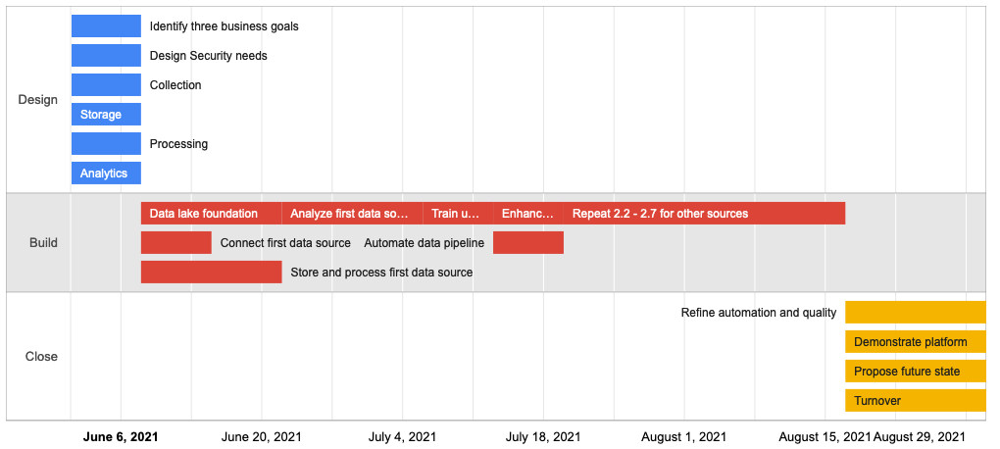
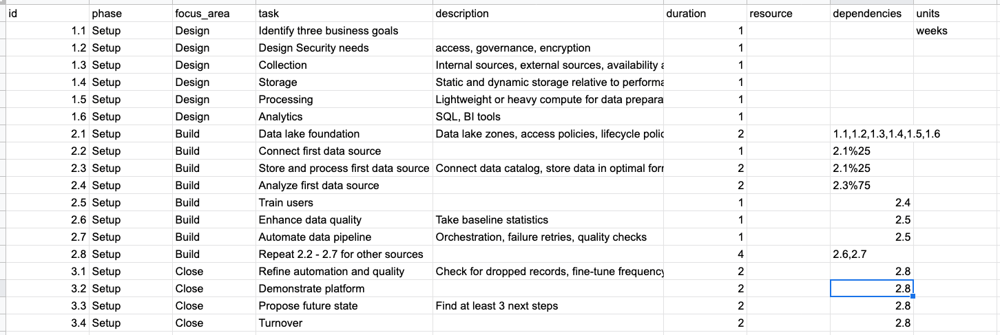

# Cloud Project Templates
Dead-simple templates in csv, tools, and visualizations to make cloud infrastructure projects go better.
* Project plan templates based on years of best practices from AWS cloud consultants
* Data, security, analytics, and machine learning projects that can be scaled to whatever size you need
* Project timelines in days or weeks
* Make a copy of the project plan and tweak it
* Get a beautiful visualization of your swimlanes with one command
* Show dependencies





## Prerequisites
Python must be installed. Install `dateutil` and `pandas`
```bash
pip install python-dateutil pandas
```

## Get Started
Clone the repository. 
The project plans are in the `project_plans` directory. Review a sample project plan either by viewing the `head` or opening in a spreadsheet program.
```bash
head project_plans/twilio_migration.csv
```

Build a timeline chart with this command, and pass in the name of the file you want to build.
```bash
python build_timeline.py project_plans/twilio_migration.csv
```
It will create a data file `input.js` and then automatically open the chart in a browser. Take a screenshot.

## Modifying the Project Plans
The project plans have the following fields:
* `id` choose a unique text id. If you use numbers like `1.01, 1.02` be aware that a common mistake is that csv readers will think `1.1` and `1.10` are the same. So make sure your ID's are unique.
* `phase` the highest-level goal of the project. It won't show up in the chart anywhere.
* `focus_area` the theme of a set of tasks, such as "Design" or "Deploy". This will group tasks in the timeline chart.
* `task` concrete task with at least 1 day or 1 week of duration.
* `description` any deeper details you want to keep with the project plan.
* `duration` the expected length of the task. This will drive how the chart looks.
* `resource` the person or role responsible for the task
* `dependencies` the tasks that must complete, or partially complete, before this this starts.

## How to label dependencies
Dependencies are written in this format:
`[id]%[percent_complete],[id]%[percent_complete],[id]`
So this list of dependencies:
`1.01,1.02%50,1.04`
means that the current task cannot start until:
* `1.01` is 100% complete, and
* `1.02` is 50% complete, and
* `1.04` is 100% complete

You can have 0 dependencies, or many. They need to be comma-separated, with no spaces.
The % complete is optional. It takes numbers from 1-99.

## Metadata
The following fields have only one value. They are metadata for your project.
* `units` accepts either `days` or `weeks` and nothing else. Required.
* `start_date` a plainly written start date for the project. Required.
* the last three are self-explanatory.

## Making new plans
Create a new CSV file using the exact same headers as the examples in this repo. Put the file in `./project_plans` and name it something obvious.